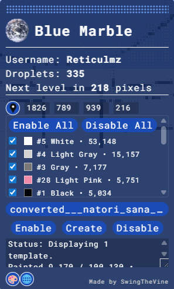

# wplace.liveにすまんこを出現させよう！！！！

なんとなく描き始めた[かにかま先生](https://x.com/kanikama3gou)の名取を手伝ってくださる方がいたので手伝ってくださる方用の画像とテンプレートの表示方法を置いておきます

[イラスト作者のツイッター](https://x.com/kanikama3gou)

## 参加方法/How to join

このプロジェクトを手伝ってくださる場合[Blue Marble](https://bluemarble.camilledaguin.fr)を導入しこの画像をインポートし以下の[座標](https://wplace.live/?lat=38.1046167643574&lng=141.1417086530273&zoom=16.374232878672384)にテンプレートを表示し塗ってくださると助かります！！！

For those who would like to collaborate, please install [Blue Marble](https://bluemarble.camilledaguin.fr), import this image, display the template according to the following [coordinate](https://wplace.live/?lat=38.1046167643574&lng=141.1417086530273&zoom=16.374232878672384), and then color it in to collaborate!!

### Blue Marbleの使い方

Upload Templateをクリックし表示したい画像を選択

表示したい座標(画像の左上が基準)をwplace上でクリックし

Blue Marbleの座標入力欄、左のボタンをクリックし(座標の自動入力)

Createボタンを押すことでテンプレートがマップ上に表示されます

## Thanks For Contribute!!!!!

- refia #5523005
- November 15th #8590770
- LargeBoots #7814582
- toroPO #6548915
- yude #1752864
- SharpStick #9941614
- QuietPencil #9941980
- StarkBroom #3299925
- LuckyBangle #10271903
- mu #10143957

(書き忘れてたらIssueでも上げてください)

